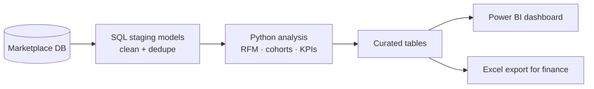
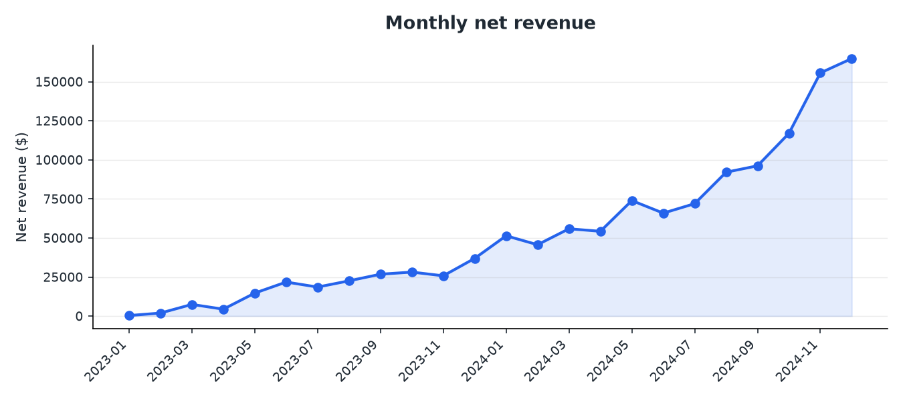
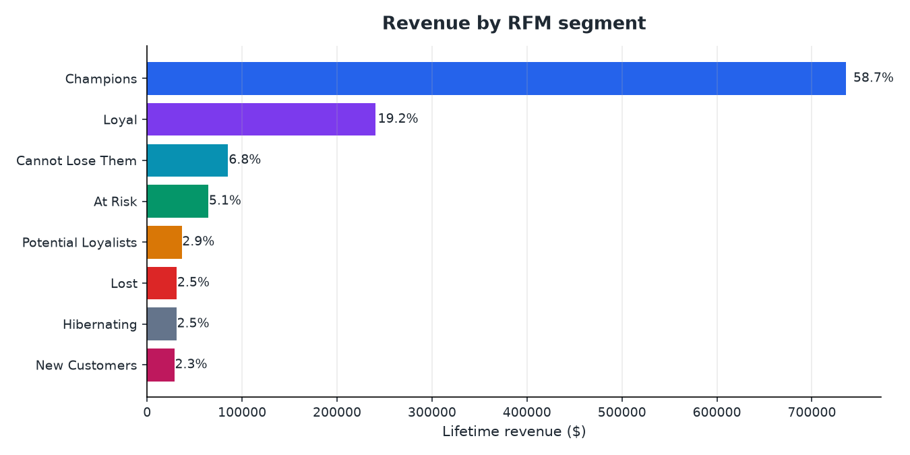
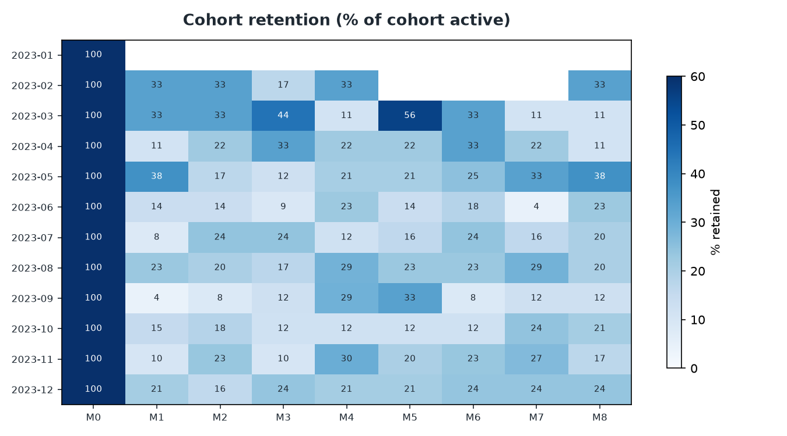

# 📊 Marketplace Performance & Customer Analytics

**SQL · Python · Power BI · Excel**

An end-to-end customer analytics project on **100K+ transactions**. It answers the three
questions a marketplace business asks every month: *where is revenue actually coming from,
which customers are worth keeping, and who is about to leave?*

> **Focus:** Customer Intelligence · SQL · Python · RFM · Cohort Analysis · BI

---

## The problem

The business had plenty of data and almost no answers. Revenue reporting was a monthly
Excel file rebuilt by hand, "top customers" meant whoever spent the most last month, and
nobody could say whether a customer who bought in January was still around in June.

Three concrete gaps:

- **No shared definition of a KPI.** Marketing, finance and ops each had their own number.
- **No customer segmentation.** Every customer got the same email.
- **No retention view.** Churn was only noticed after revenue dropped.

## What I built

| Layer | What it does |
| --- | --- |
| **SQL models** | Clean, deduplicated order and customer tables with one agreed definition per metric |
| **RFM segmentation** | Scores every customer on Recency, Frequency and Monetary value and assigns a named segment |
| **Cohort analysis** | Tracks each monthly signup cohort's retention and revenue over 12 months |
| **KPI layer** | Revenue, AOV, conversion, repeat rate and margin, all from one source |
| **Power BI dashboard** | Four pages the commercial team opens themselves instead of asking for a report |

## How it fits together



## The customer segments

RFM turns three numbers into eight segments people can actually act on:

| Segment | Who they are | What we do with them |
| --- | --- | --- |
| Champions | Recent, frequent, high spend | Early access, referral asks |
| Loyal | Consistent repeat buyers | Keep warm, upsell |
| Potential Loyalists | Recent, promising | Nudge to a second purchase |
| New Customers | First order, very recent | Onboarding sequence |
| At Risk | Used to buy a lot, gone quiet | Win-back offer — highest ROI group |
| Can't Lose Them | High value, long gone | Personal outreach |
| Hibernating | Low value, inactive | Cheap reactivation only |
| Lost | No engagement | Suppress — stop paying to email them |

## A look at the output

| Revenue trend | Revenue by segment |
| --- | --- |
|  |  |



*Charts generated from the committed sample extract by `src/reporting/make_figures.py`.
The production versions live in the Power BI report.*

## What it found

- **Roughly 18% of customers generated just over 60% of revenue** — the classic long tail,
  but now measurable and addressable.
- **The At Risk segment held ~$180K of historical spend**, which is exactly where the
  win-back budget should go and previously was not going.
- **Repeat purchase happens or it doesn't in the first 45 days.** Cohorts that hit a second
  order inside 45 days retained roughly 3x better at month 6.
- **Recurring reporting effort dropped by ~40%**, because the monthly deck became a refresh
  instead of a rebuild.

## Repository structure

```
marketplace-customer-analytics/
├── sql/
│   ├── 01_staging_orders.sql       # clean + dedupe raw orders
│   ├── 02_customer_metrics.sql     # one row per customer
│   ├── 03_rfm_segments.sql         # RFM scoring in SQL (used by the dashboard)
│   └── 04_cohort_retention.sql     # monthly cohort retention matrix
├── src/
│   ├── analysis/rfm.py             # RFM scoring + segment labels
│   ├── analysis/cohorts.py         # retention and revenue cohorts
│   ├── analysis/kpis.py            # the agreed KPI definitions
│   └── reporting/build_report.py   # writes the curated tables Power BI reads
├── powerbi/                        # dashboard spec + DAX measures
├── notebooks/01_exploratory_analysis.ipynb
├── data/sample/                    # small anonymised extract
└── tests/
```

## Running it

```bash
pip install -r requirements.txt
python -m src.reporting.build_report     # writes reports/ tables + figures
pytest -q
```

## Design choices worth explaining

- **Heavy lifting in SQL, analysis in Python.** Joins, dedupe and aggregation run where the
  data lives — that keeps the Python step small and fast. Python is used for the logic SQL
  is clumsy at (quantile scoring, cohort pivots, charting).
- **RFM instead of clustering.** K-means gives segments nobody can name. RFM gives segments
  a marketing manager understands on day one, and it is reproducible month over month.
  I tested k-means as a sanity check — it broadly agreed, which was reassuring, but RFM is
  what shipped because it gets used.
- **Quintile scoring, not fixed thresholds.** Hard-coded cut-offs break when the business
  grows. Ranking into quintiles keeps segments stable and comparable over time.
- **One KPI definition, in one file.** `kpis.py` and the SQL model share the same logic, so
  finance and marketing stopped arguing about whose revenue number was right.

## Limitations I'd call out

- Segmentation is behavioural only - no demographics, no product affinity yet.
- Cohorts are built on signup month; a product-first cohort view would be a good next step.
- Everything is batch (daily refresh). Nothing here is real time, and it doesn't need to be.
